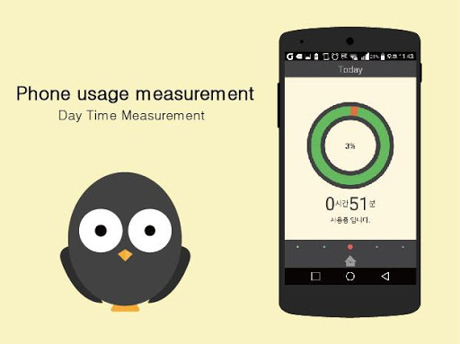
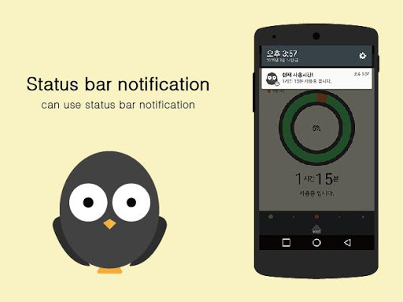
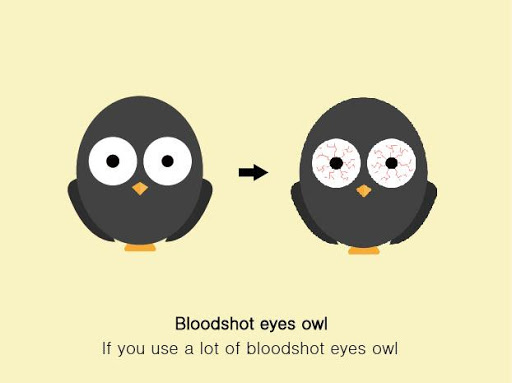

# owl   

`updated` : 2015년 9월 6일    
`status` : paused

Mobile phone usage measurements, weekly usage management   

~~~
Mobile Phones catching all day ....
Do not know when turn off the screen all day ....
Eyes become dim all day ......

Now, you can prevent Phone poisoning by Owl!
Owl tells the number of times you turn on the day, week, hour and cell phone use.

By launching an owl in the status bar always check the time!

'Owl makes it measures the cell phone usage.
It gives to measure the operating time per day,
You can learn usage patterns for a week. "

[ver 1.0]
Owl Mobile phone usage measurement.
~~~   

